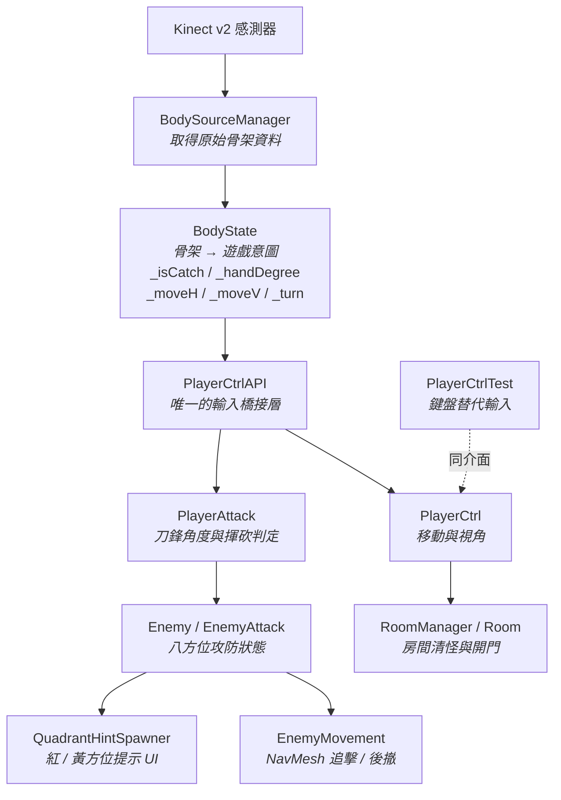

# ⚔️ Demon Slayer

> **以 Kinect v2 體感操控的第一人稱刀劍戰鬥遊戲** — 不用手把，用你的身體站位，用你的雙臂當刀。


---

## ▶ 遊玩示範

[](https://www.youtube.com/watch?v=GHl9-KnaAF8)

<sup>點擊圖片觀看完整遊玩示範</sup>

---

## 遊戲概念

玩家站在 Kinect 感測器前，**雙手在身前合握**即化身為持刀的劍士，在陰暗的地牢中與惡鬼交戰。

這款遊戲的核心不是「揮得多快」，而是**看懂敵人身上浮現的方位提示，並用正確的揮砍角度回應**：

- 🔴 **紅色提示** — 敵人即將從該方位攻擊，必須在它落下前揮向該處**格擋**
- 🟡 **黃色提示** — 敵人的**弱點**暴露在該方位，揮中即造成傷害

提示只存在數秒，於是每一場戰鬥都變成「辨識 → 抬臂到正確角度 → 揮砍」的即時身體反應，而不是連打按鍵。

---

## 操作方式

全程以身體姿勢操作，無需任何控制器：

| 遊戲動作 | 身體姿勢 | 偵測依據 |
| --- | --- | --- |
| **持刀 / 收刀** | 雙手在身前合握（兩手指尖靠攏） | 左右手指尖的 X、Y 距離皆小於 12.5 cm，且雙肘在追蹤範圍內 |
| **刀鋒指向** | 持刀後，將雙手繞著胸口畫出角度 | 雙手中點相對於胸口（SpineMid）的夾角，需離胸口 20 cm 以上 |
| **揮砍** | 將刀從一側大幅揮向對側 | 起始與結束角度落在相隔約 135°–225° 的方位區塊 |
| **前進 / 後退** | 身體前傾 / 後仰 | 頸椎–脊椎基座與頭–頸的 Z 軸夾角 |
| **左右橫移** | 身體向左 / 向右側傾 | 頭部相對脊椎基座的 X 軸傾斜角 |
| **轉動視角** | 收起單邊手臂（讓該側手肘離開追蹤） | 左肘失去追蹤 → 左轉；右肘失去追蹤 → 右轉 |

> **沒有 Kinect 也能試玩。** 專案內建鍵盤替代輸入 `PlayerCtrlTest`，與體感輸入共用完全相同的下游介面：
> `W`/`A`/`S`/`D` 移動、方向鍵轉動視角、`Ctrl` + `←`/`→` 旋轉刀鋒、`Space` 直接揮砍。

---

## 核心機制：八方位攻防

刀鋒的 360° 被切分為 **8 個 45° 的方位區塊**，敵人的攻擊點與弱點也生成在同一組座標上 —— 玩家與敵人因此共用一套「共通語言」。

```text
        0 上
   7 ↖   ↑   ↗ 1
        \ | /
 6 ←  ———╳———  → 2
        / | \
   5 ↙   ↓   ↘ 3
        4 下
```

**敵人如何出題**（[`EnemyAttack.cs`](Assets/Scripts/Enemy/EnemyAttack.cs)）

每隔一段時間，敵人會重新洗牌自己的八方位狀態：

- 依 `strength` 計算攻擊機率（`0.4 + strength × 0.1`），命中則隨機挑一個方位設為**攻擊點**，並在 3 秒的預備時間後對玩家造成傷害
- 同時依 `strength` 反比生成 **1–3 個弱點**（越強的敵人破綻越少）
- 生成的方位透過 [`QuadrantHintSpawner`](Assets/Scripts/Enemy/QuadrantHintSpawner.cs) 轉為畫面上的紅 / 黃提示，並帶有由大縮小的淡入淡出動畫，形成天然的反應倒數

**玩家如何解題**（[`PlayerAttack.cs`](Assets/Player/PlayerAttack.cs)）

揮砍不是單點觸發，而是**一段跨區塊的軌跡**：系統取刀鋒的起始與結束區塊，只有兩者相隔 3–5 格（接近對向）時才判定為一次有效揮擊，避免手臂微幅晃動被誤判成攻擊。

- 揮中**攻擊點** → 攻擊被格擋，敵人中斷動作並恢復移動
- 揮中**弱點** → 敵人受到傷害（每次 20，敵人滿血 100）

敵人平時由 `NavMeshAgent` 驅動追擊與後撤（[`EnemyMovement.cs`](Assets/Scripts/Enemy/EnemyMovement.cs)），進入攻擊預備時停下不動 —— 這個停頓正是玩家辨識提示並反擊的窗口。

---

## 系統架構

整套輸入處理被刻意切成四層，**每一層只做一件事**：



這個分層帶來的關鍵好處是 **輸入來源可以整組抽換**：`BodyState` 只負責把生硬的關節座標翻譯成「玩家想做什麼」（是否持刀、刀指向幾度、要往哪走），`PlayerCtrlAPI` 是唯一的橋接點，下游的 `PlayerCtrl` 與 `PlayerAttack` 完全不知道輸入來自 Kinect 還是鍵盤。因此 `PlayerCtrlTest` 只需實作相同呼叫，就能在沒有感測器的環境下開發與測試整套戰鬥邏輯。

**關卡層**則獨立於戰鬥之外：`RoomManager` 持續輪詢各房間狀態，`Room` 在啟動時以 `OverlapBox` 記錄房內敵人，全數清除後自動移除封鎖的牆壁；`TeleportPlate` 提供踩踏傳送，共同組成地牢的推進節奏。

---

## 專案結構

```text
Assets/
├── KinectManager/              # 體感輸入層
│   ├── BodySourceManager.cs    #   開啟感測器、取得骨架幀
│   ├── BodyState.cs            #   骨架 → 遊戲意圖（核心翻譯層）
│   ├── BodySourceView.cs       #   骨架除錯視覺化
│   └── Model/JointModel.cs     #   關節資料封裝
│
├── PlayerCtrlAPI.cs            # 體感 → 玩家行為的橋接層
├── Player/
│   ├── PlayerCtrl.cs           #   移動、視角、重力
│   ├── PlayerAttack.cs         #   刀鋒旋轉、八方位揮砍判定
│   ├── PlayerCtrlTest.cs       #   鍵盤替代輸入（無 Kinect 時使用）
│   ├── PlayerScript.cs         #   玩家生命值
│   └── SwordGripIK.cs          #   雙手持刀的 IK 綁定
│
├── Scripts/
│   ├── Enemy/
│   │   ├── Enemy.cs            #   敵人協調器、生命值與死亡事件
│   │   ├── EnemyAttack.cs      #   八方位攻擊點 / 弱點生成與互動
│   │   ├── EnemyMovement.cs    #   NavMesh 追擊與後撤
│   │   ├── QuadrantHint.cs     #   單一方位提示的動畫與生命週期
│   │   └── QuadrantHintSpawner.cs  # 八方位提示 UI 的統籌
│   └── Interface/IDirectionProvider.cs  # 方位型別定義
│
├── Scenes/                     # 關卡層
│   ├── Room.cs / RoomManager.cs    # 房間清怪與開門
│   └── TeleportPlate.cs            # 踩踏傳送
│
├── script/                     # UI 與流程
│   ├── healthbar.cs / SceneLoader.cs / ExitGameButton.cs
│
└── Plugins/                    # Kinect Unity Addin 原生 DLL
```

美術資源（地牢模組、敵人模型、武器與角色）置於 `DungeonModularPack/`、`Multistory Dungeons 2/`、`EnemyModel/`、`katana/`、`sword/` 等資料夾。

---

## 執行方式

**環境需求**

| 項目 | 版本 / 說明 |
| --- | --- |
| Unity | 2022.3.35f1 (LTS) |
| 算繪管線 | Universal Render Pipeline 14.0.11 |
| 作業系統 | Windows（Kinect SDK 限定） |
| 感測器 | Kinect v2 + [Kinect for Windows SDK 2.0](https://www.microsoft.com/en-us/download/details.aspx?id=44561)（選用） |
| Git LFS | 必要 — 模型檔（`.fbx`）以 LFS 儲存 |

**啟動步驟**

```bash
git clone https://github.com/Ice8588/DemonSlayer.git
cd DemonSlayer
git lfs pull          # 取得以 LFS 儲存的 .fbx 模型
```

以 Unity Hub 加入專案並以 **2022.3.35f1** 開啟，載入 `Assets/Scenes/start_scene.unity` 後執行即可。

若手邊沒有 Kinect v2，改用場景中的 `PlayerCtrlTest` 元件，即可用鍵盤操作完整體驗戰鬥流程。
